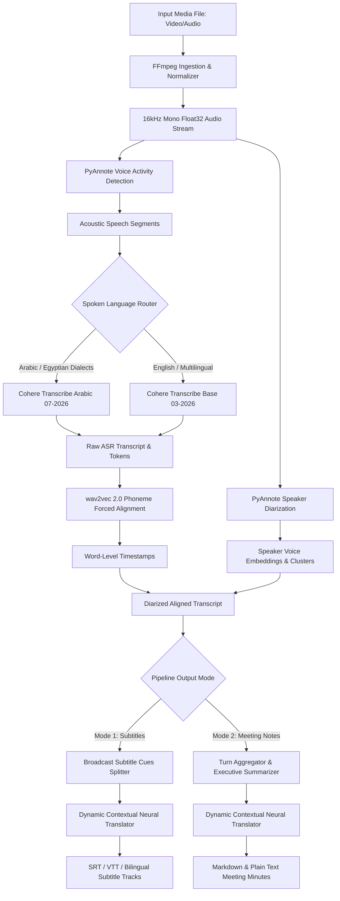

# 🔬 Technical Architecture & Deep-Dive Engine Reference

This document provides a comprehensive technical breakdown of **CohereX Studio**, explaining how audio ingestion, acoustic segmentation, speech recognition, forced alignment, speaker diarization, subtitle splitting, and dynamic neural translation work under the hood.

---

## 🏗️ System Architecture Flowchart



---

## 1. 🔊 Ingestion & Audio Normalization (`coherex/extract_audio.py`)

### Problem
Raw user uploads come in hundreds of container formats (`.mp4`, `.mkv`, `.avi`, `.mov`, `.webm`, `.mp3`, `.m4a`, `.flac`) with varying sample rates (44.1kHz, 48kHz), multiple audio channels (stereo, 5.1 surround), and variable bitrates.

### Technical Solution
- Uses an automated **FFmpeg wrapper pipeline** to extract and normalize audio streams:
  ```bash
  ffmpeg -y -i input_video.mp4 -vn -acodec pcm_s16le -ar 16000 -ac 1 output.wav
  ```
- **16kHz Single-Channel PCM**: Downmixes multi-channel audio to mono and resamples directly to 16,000 Hz, matching the exact acoustic receptive field of modern transformer speech encoders.
- Converts to NumPy `float32` arrays in range `[-1.0, 1.0]` for GPU tensor operations.

---

## 2. 🎚️ Voice Activity Detection & Segmentation (`coherex/vads/pyannote.py`)

### Problem
Long audio files (e.g. 30-minute to 2-hour movies or podcasts) cannot be fed into transformer attention layers as a single unbroken sequence due to $O(N^2)$ memory scaling and hallucination on long silence intervals.

### Technical Solution
- Employs **PyAnnote VAD (Voice Activity Detection)**:
  - Computes temporal frame-level speech probabilities using a neural convolutional-recurrent backbone.
  - Applies hysteresis thresholding:
    - `vad_onset` (default `0.45`): Probability threshold to trigger speech detection.
    - `vad_offset` (default `0.35`): Probability threshold to release speech detection.
- **Segment Merging & Padding**: Merges adjacent short speech bursts separated by brief pauses ($< 0.5\text{s}$) while bounding segment lengths between 3.0s and 30.0s for optimal batched inference.

---

## 3. 🎙️ ASR Model Dispatcher & Token Decoding (`coherex/asr.py`)

### Model Architecture
Cohere Transcribe models are built on high-capacity encoder-decoder transformer architectures:
- **Encoder**: Converts audio filterbanks into dense temporal representations.
- **Decoder**: Autoregressively generates subword tokens with cross-attention over encoder states.

### Automatic Model Router
The system dynamically selects the optimal model based on spoken language:
1. **Arabic Dialect Specialist (`CohereLabs/cohere-transcribe-arabic-07-2026`)**:
   - Specifically finetuned on thousands of hours of Arabic colloquial speech, Egyptian dialect banter, mixed code-switching (Arabic-English terms), and rapid dialogue.
   - Accurately captures colloquial idioms, artist names, and informal speech where standard multilingual models hallucinate.
2. **Multilingual Generalist (`CohereLabs/cohere-transcribe-03-2026`)**:
   - Trained across 14 languages (`en`, `es`, `fr`, `de`, `it`, `pt`, `nl`, `pl`, `el`, `ja`, `zh`, `vi`, `ko`).

### Degeneracy & Repetition Filter
During musical intros or high background noise, autoregressive decoders can enter repetition loops (e.g. repeating a word 10 times). CohereX incorporates an n-gram repetition detector that identifies and prunes cyclic tokens before downstream emission.

---

## 4. ⏱️ Phoneme Forced Alignment (`coherex/alignment.py`)

### Problem
Autoregressive ASR output gives chunk-level timestamps (start and end of 10–20 second blocks), but does not give millisecond precision for individual words.

### Technical Solution
- Uses **wav2vec 2.0 CTC acoustic models** for phoneme forced alignment:
  1. Computes character/phoneme emission probabilities across the audio frame sequence.
  2. Constructs a 2D dynamic programming Trellis matrix matching the emitted ASR text sequence against the acoustic emissions.
  3. Backtracks through the optimal Viterbi path to determine exact start and end timestamps for every individual word.

---

## 5. 👥 Speaker Diarization (`coherex/diarize.py`)

### Problem
Identifying *who spoke when* across multi-speaker interviews, podcasts, or meeting recordings.

### Technical Solution
- Uses **PyAnnote Diarization 3.1**:
  1. **Voice Feature Extraction**: Extracts 512-dimensional x-vector speaker embeddings over sliding 1.5s sub-windows.
  2. **Spectral / Agglomerative Clustering**: Groups embeddings based on cosine similarity into distinct speaker clusters (`SPEAKER_00`, `SPEAKER_01`, etc.).
  3. **Speaker-Word Intersection**: Intersects word-level timestamp intervals $[t_{\text{start}}, t_{\text{end}}]$ with speaker turn intervals to assign speaker labels to every word in the transcript.

---

## 6. 🎬 Broadcast Subtitle Splitting Engine (`coherex/subtitles.py`)

### Problem (Why previous outputs covered the screen)
Displaying an un-split 25-second ASR chunk in a video player causes 6–8 lines of text to obscure the entire video frame.

### Technical Solution
`coherex.subtitles` converts raw speech blocks into broadcast-standard subtitle cues obeying international subtitle standards (Netflix / BBC / EBU-TT):

$$\text{Max Line Length} \le 38\text{ characters}, \quad \text{Max Lines per Cue} \le 2, \quad \text{Duration} \in [1.2\text{s}, 5.5\text{s}]$$

### Splitting Algorithm:
1. **Punctuation Boundary Decomposition**: Splits text at natural linguistic boundaries (`.`, `!`, `?`, `؟`, `،`, `,`, `;`, `:`).
2. **Reading Speed & Duration Distribution**: Distributes duration proportionally based on character count:
   $$t_{\text{cue\_dur}} = \text{max}\left(1.2\text{s}, \, \Delta t_{\text{segment}} \times \frac{\text{len}(\text{cue})}{\text{len}(\text{segment})}\right)$$
3. **Balanced Line Wrapping**: Splits cues longer than 38 characters into 2 balanced lines without breaking individual words.

---

## 7. 🌍 Dynamic Neural Translation (`coherex/translator.py`)

### Problem
Literal word-by-word translation produces broken, robotic subtitles that lose conversational meaning, humor, and dialectal context.

### Technical Solution
- **Dynamic Contextual Engine**:
  - Translates full clauses and sentences as cohesive semantic thoughts.
  - Employs neural translation endpoints with sliding context windows to resolve ambiguous pronouns.
  - Normalizes target grammar, capitalization, and punctuation for subtitle display.
- **Dual-Track Bilingual Synchronization**:
  - Generates synchronized pairs where the translated line (e.g. English) is displayed on top, and the original line (e.g. Arabic) is displayed below, maintaining identical timing cues.

---

## 8. 📋 Meeting Intelligence Engine (`coherex/meeting_notes.py`)

### Technical Solution
- **Turn Aggregator**: Groups consecutive utterances by the same speaker within a temporal proximity window ($\Delta t < 3.5\text{s}$) into clean paragraphs.
- **Executive Summarizer**: Synthesizes the discussion opening and primary topics into an executive overview.
- **Salient Milestone Extraction**: Extracts key conversational statements with timestamps.
- **Multi-Format Synthesis**: Emits structured Markdown (`.md`), plain text (`.txt`), and JSON schema for enterprise notes archiving.
